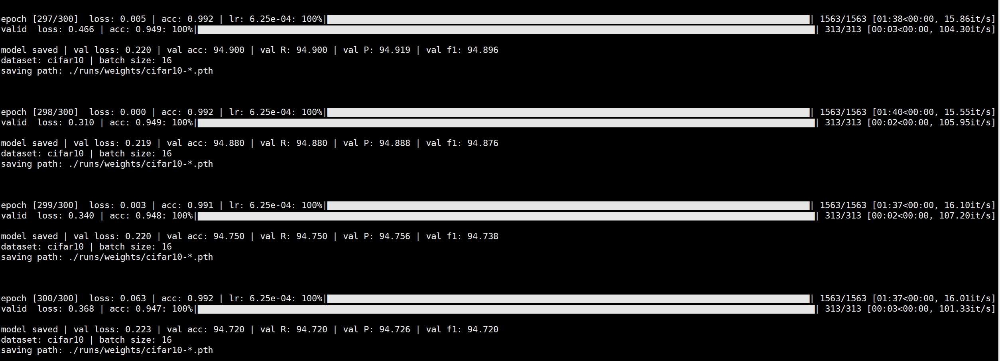

# 训练 CIFAR-10

## 环境配置

使用`Python=3.7`

```bash
pip install -r requirements.txt
```

## 训练命令

使用多卡分布式并行训练，e.g.

```bash
CUDA_VISIBLE_DEVICES=0,1 torchrun --nproc_per_node=2 train.py  --dataset cifar10 --epochs 300 --lr 1e-2 --eval-interval 1 --batch-size 32
```

## 模型架构

首先采用**残差块**依次下采样至2倍、4倍和8倍，再在下采样8倍的特征图上使用4层**自注意力模块**，**所有模块均由自己搭建完成**。


## 实验

### 参数设置

实验参数设置如下：

`epochs=300`

`batch_size=32`

SGD优化器：`初始lr=0.01` `batch_size=32` `momentum=0.9` `weight_decay=1e-4`

Warmup + MultiStepLr 学习率调整策略：`warmup_epochs=1` `warmup_factor=0.01` `step=[60, 120, 200, 260]` `step_factor=0.5`

学习率变化曲线：


### 模型训练

loss变化曲线：


准确率（Accuracy）变化曲线：


**最终准确率为 94.29%，召回率为 94.29%，精确率为 94.29%，F1-Score为 94.28%**





### 超参数调节

使用与上面同样的 Warmup + MultiStepLr 学习率调整策略，epoch=300，观察 **batch_size**、**初始学习率** 对训练效果的影响。

| 初始学习率 | batch_size | 最终Loss  | 最终准确率（%） |
| :--------: | :--------: | :-------: | :-------------: |
|    1e-2    |     1      |    NaN    |        /        |
|    1e-2    |     4      |    NaN    |        /        |
|    1e-2    |     8      |    NaN    |        /        |
|    1e-2    |     16     | **0.200** |    **94.52**    |
|    1e-2    |     32     |   0.242   |      94.29      |
|    1e-2    |     64     |   0.269   |      92.53      |
|    1e-2    |    128     |   0.316   |      90.88      |
|    1e-2    |    256     |   0.367   |      88.80      |
|    1e-2    |    512     |   0.423   |      85.74      |
|            |            |           |                 |
|    1e-4    |     1      |   0.332   |      89.53      |
|    1e-4    |     4      |   0.325   |      90.29      |
|    1e-4    |     8      |  *0.272*  |     *91.21*     |
|    1e-4    |     16     |   0.466   |      84.62      |
|    1e-4    |     32     |   0.643   |      78.25      |
|    1e-4    |     64     |   0.806   |      72.02      |
|    1e-4    |    128     |   1.054   |      63.16      |
|    1e-4    |    256     |   1.314   |      52.29      |
|    1e-4    |    512     |   1.447   |      47.29      |

初始学习率1e-2 + Warmup + MultiStepLr 学习率调整策略下的 loss 曲线对比（batch_size=1,4,8 的情况因为出现梯度爆炸，所以未画出）：


初始学习率1e-2 + Warmup + MultiStepLr 学习率调整策略下的 准确率（Accuracy）曲线对比（batch_size=1,4,8 的情况因为出现梯度爆炸，所以未画出）：


**实验发现**

在训练本网络时：

- 初始学习率为 1e-2，当 batch_size=1,4,8 时，网络会出现梯度爆炸的情况；当 batch_size=16 时，最终loss数值最小，最终准确率最高；从 batch_size=16 开始，随着 batch_size 的增大，网络训练效果逐渐变差。

- 初始学习率为 1e-4，当 batch_size=1,4,8 时，随着 batch_size 的增大，网络训练效果逐渐变好；当 batch_size=8 时，最终loss数值最小，最终准确率最高；当 batch_size>8 时，随着 batch_size 的增大，网络训练效果逐渐变差。

- 当 batch_size=1,4,8 时，初始学习率从 1e-2 降低到 1e-4，可以有效防止梯度爆炸。
- 当 batch_size>16 时，初始学习率从 1e-2 降低到 1e-4，最终效果会显著变差。

**结论与分析**

- 初始学习率为1e-2时，batch_size 在 16~64 的时候能够发挥很好的效果；batch_size 过大，会使得梯度方向几乎不变，容易陷入局部最优，此时应使用较大学习率进行训练；batch_size 过小，梯度方向高度不确定，此时应当降低学习率，缓慢收敛，防止梯度爆炸。
- 初始学习率是影响网络训练效果的重要因素，其设置要参照 batch_size 的大小，一般来说，小 batch_size 对应较小初始学习率，大 batch_size 对应较大学习率。


