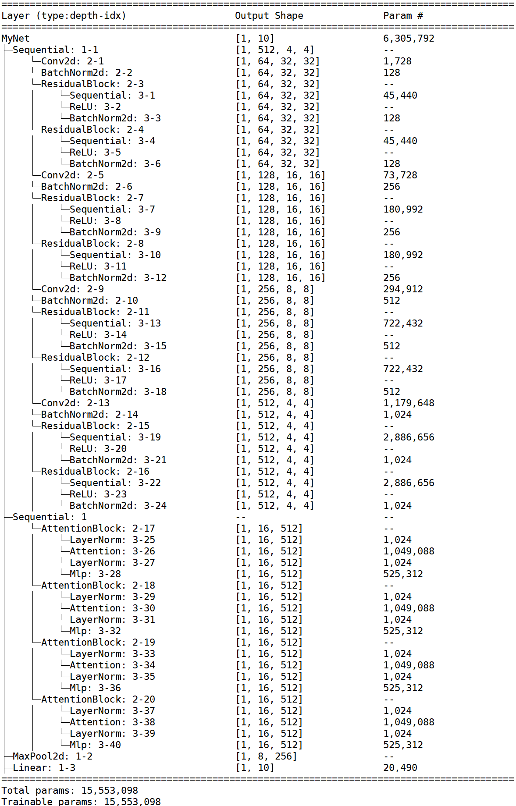
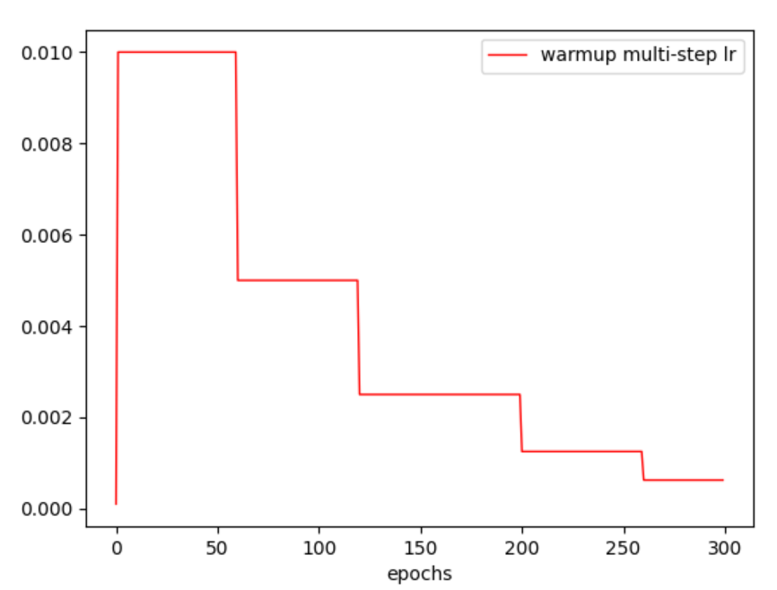
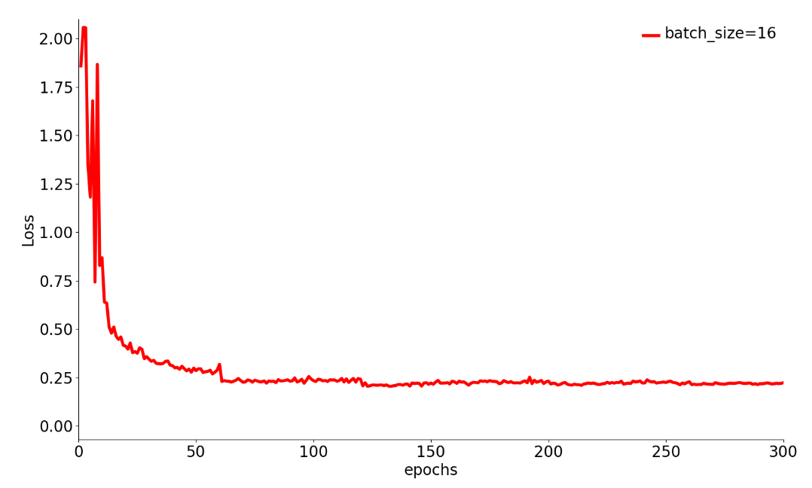
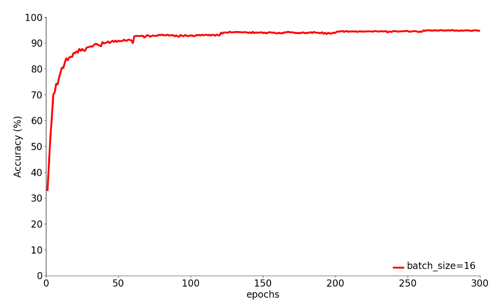
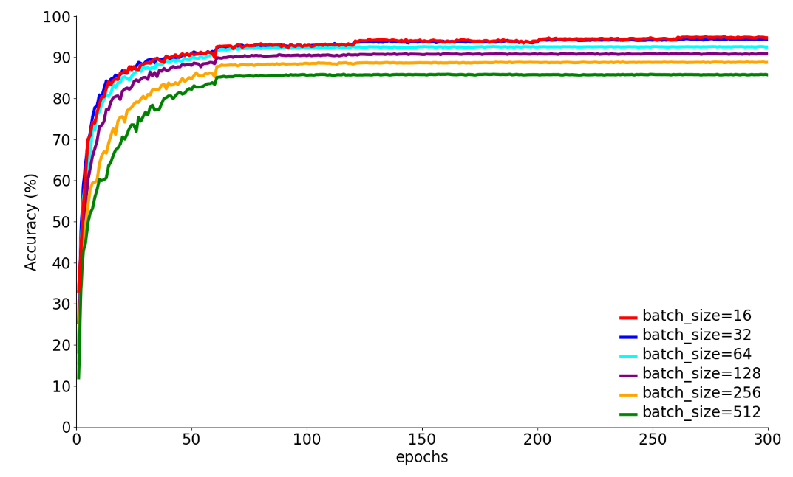

# 训练 CIFAR-10

## 环境配置

 使用`Python=3.7`

```bash
pip install -r requirements.txt
```

## 训练命令

使用多卡分布式并行训练，e.g.

```bash
CUDA_VISIBLE_DEVICES=0,1 torchrun --nproc_per_node=2 train.py  --dataset cifar10 --epochs 300 --lr 1e-2 --eval-interval 1 --batch-size 32
```

## 模型架构

首先采用残差块依次下采样至2倍、4倍和8倍，再在下采样8倍的特征图上使用4层自注意力模块，**所有模块均由自己搭建完成**。




## 实验

### 参数设置

实验参数设置如下：

`epochs=300`

`batch_size=32`

SGD优化器：`lr=0.02` `batch_size=32` `momentum=0.9` `weight_decay=1e-4`

Warmup + MultiStepLr 学习率调整策略：`warmup_epochs=1` `warmup_factor=0.01` `step=[60, 120, 200, 260]` `step_factor=0.1`

学习率变化曲线：




### 模型训练

loss变化曲线：



准确率（Accuracy）变化曲线：




**最终准确率为 94.04%，召回率为 94.04%，精确率为 94.04%，F1-Score为 94.03%**


插入命令行图片


### 超参数调节

使用与上面同样的学习率调整策略，epoch=300，观察 **batch_size** 对训练效果的影响。

从最终结果中可以看出，batch_size=16 时，最终loss数值最小，最终准确率最高；从 batch_size=16 开始，随着 batch_size 的增大，网络训练效果逐渐下滑；batch_size=1,4,8时，网络会出现梯度爆炸的情况，原因是初始学习率为1e-2，对于小 batch_size 来说太大了。

由此可得结论：学习率为1e-2时，batch_size 在 16~32 的时候能够发挥很好的效果，当batch_size过小时，应当降低学习率，防止梯度爆炸。

| batch_size | 初始学习率 | 最终Loss  | 最终准确率（%） |
| :--------: | :--------: | :-------: | :-------------: |
|     1      |    1e-2    |    NaN    |      10.00      |
|     1      |    1e-4    |   0.332   |      89.53      |
|     4      |    1e-2    |    NaN    |      10.00      |
|     4      |    1e-4    |           |                 |
|     8      |    1e-2    |    NaN    |      10.00      |
|     8      |    1e-4    |           |                 |
|     16     |    1e-2    | **0.200** |    **94.52**    |
|     32     |    1e-2    |   0.234   |      94.04      |
|     64     |    1e-2    |   0.269   |      92.53      |
|    128     |    1e-2    |   0.316   |      90.88      |
|    256     |    1e-2    |   0.367   |      88.80      |
|    512     |    1e-2    |   0.423   |      85.74      |


初始学习率1e-2 + Warmup + MultiStepLr 学习率调整策略下的 loss 曲线对比（batch_size=1,4,8 的情况因为出现梯度爆炸，所以未画出）：


初始学习率1e-2 + Warmup + MultiStepLr 学习率调整策略下的 准确率（Accuracy）曲线对比（batch_size=1,4,8 的情况因为出现梯度爆炸，所以未画出）：

